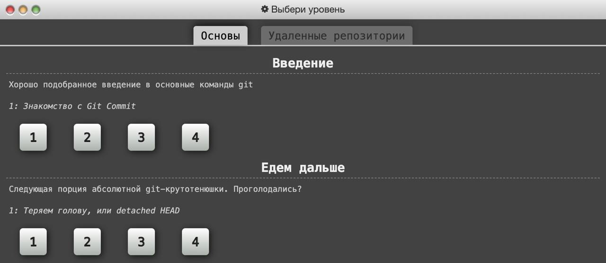
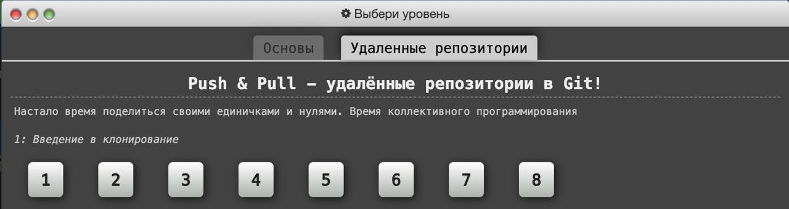
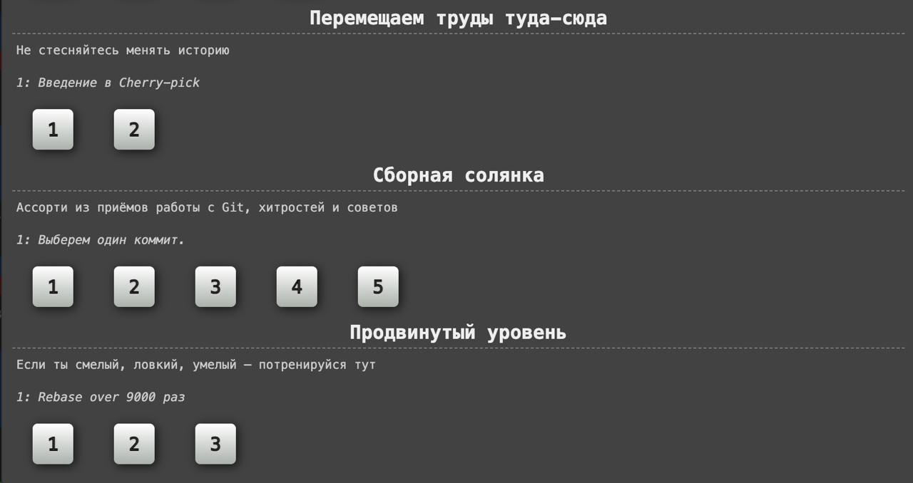
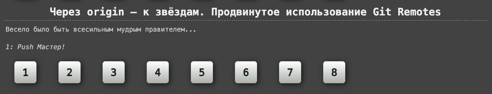

## Домашнее задание по Git

Открываем интерактивный учебник https://learngitbranching.js.org/?locale=ru_RU

Всего в учебнике 18 задач на первой вкладке ("Основы") и ещё 16 на второй ("Удаленные репозитории").

Домашнее задание будет считаться успешно пройденным, если будет решена его *обязательная* часть. 
В систему для проверки необходимо загрузить две фотографии: ваше селфи с первой и со второй вкладкой с задачами. На фоторгафии должно быть различимо ваше лицо, а также хорошо видно страницу с задачами.

**Важно:** сайт сохраняет прогресс прохождения в cookie браузера. Очистка cookie и режим инкогнито могут удалить ваш прогресс в выполнении заданий.  

#### надо ли сфоткаться для референса?

### Обязательная часть

Навыки, полученные при решении этих задач потребуются для дальнейшнего обучения.

Первые 8 задач c вкладки "Основы" обязательны для решения и оцениваются в **10 баллов**.

Первые 8 задач c вкладки "Удаленные репозитории" также обязательны для решения и оцениваются также в **10 баллов**.

Таким образом за основную часть можно получить **20 баллов**

### Дополнительная часть

Оставшиеся 18 задач будут стоить каждая по **2** дополнительных балла. Итого **36 баллов**.

Суммарно за эту работу можно получить **56 баллов**.

### Полезные команды:

1. `objective` - покажет текущее задание
2. `help level` - покажет окно с необходимой информацией и примерами
3. `levels` - открывает выбор уровня
4. `reset` - перезапустит текущий уровень
5. `undo` - отменит последнее действие
6. `hint` - покежт подсказку по заданию
7. `show commands` - покажет все доступные команды
