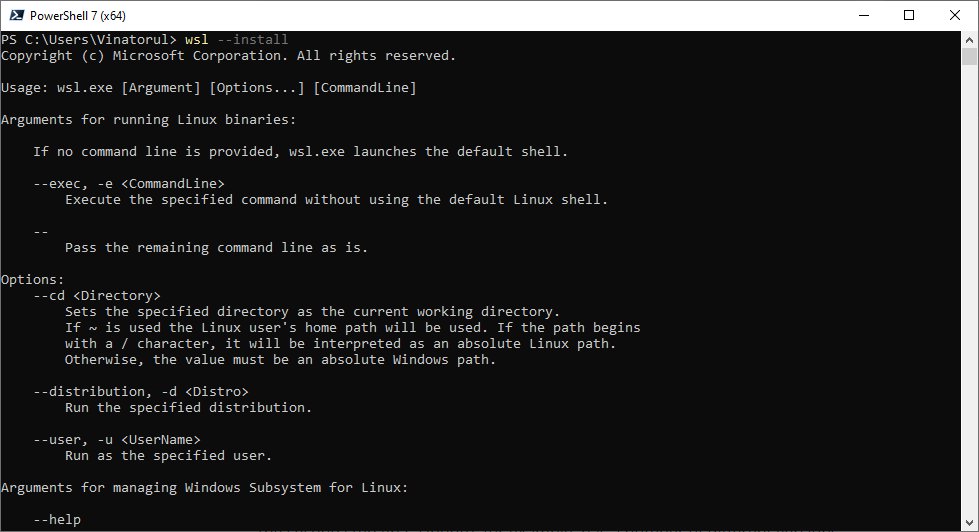
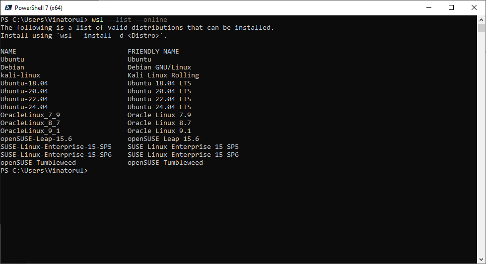
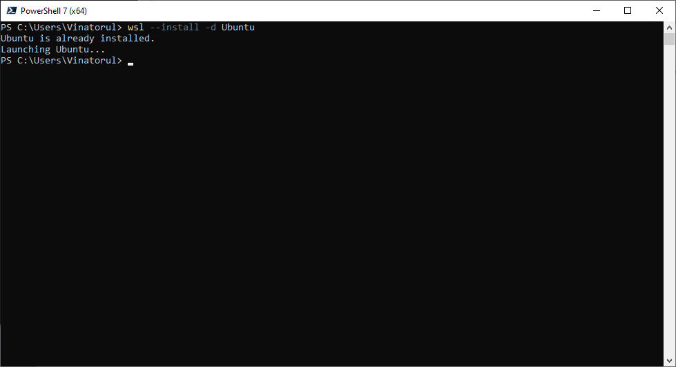
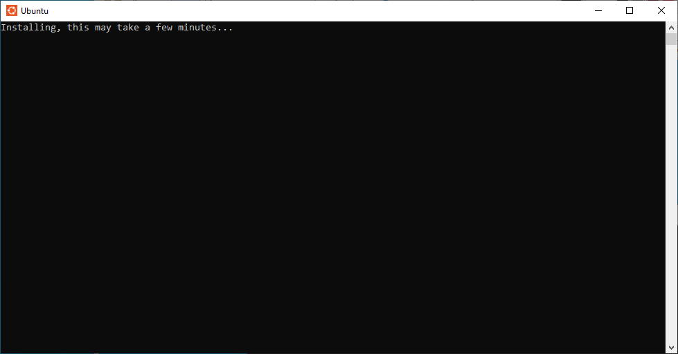
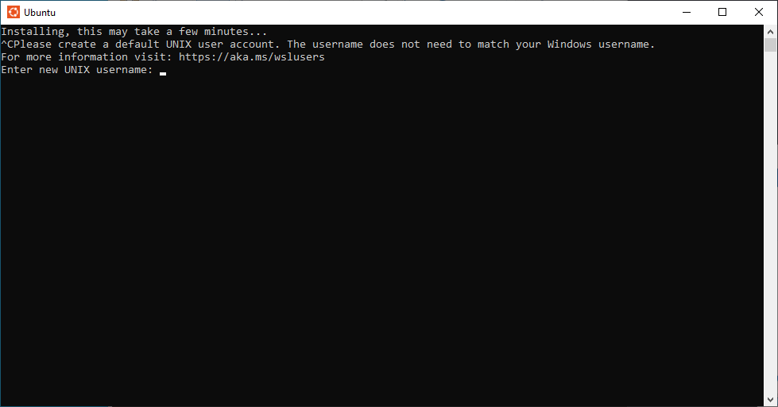
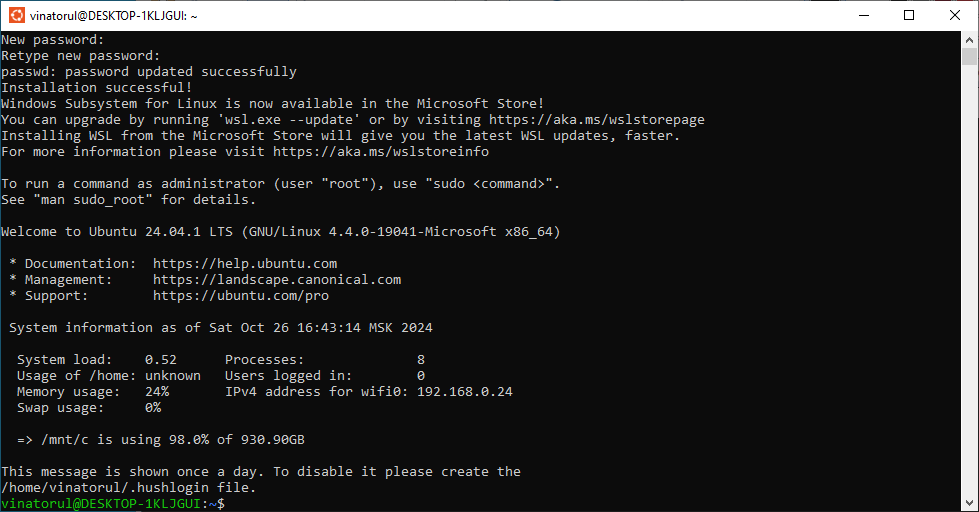
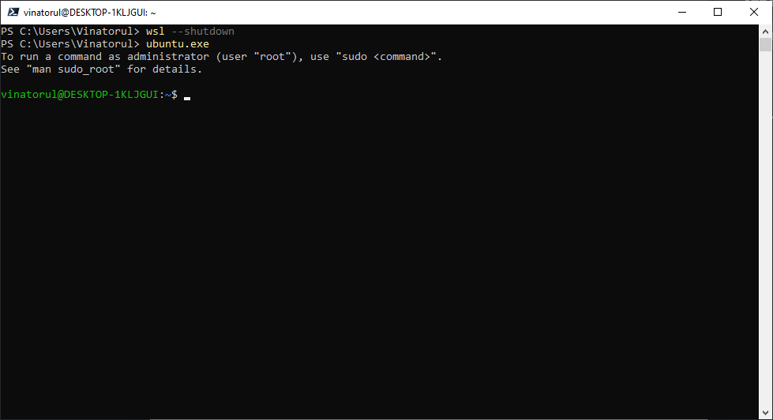
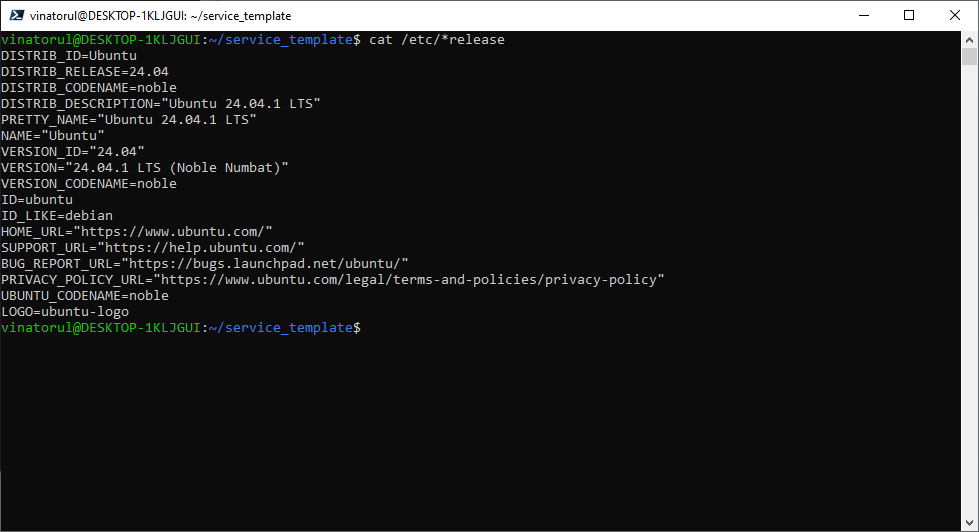
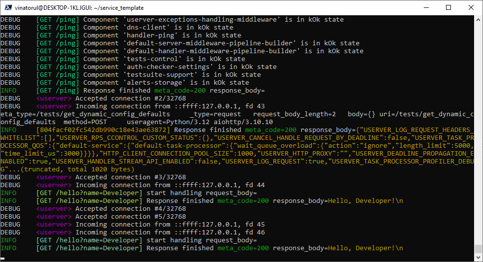

# Первая установка

**Важно:** Если у вас возникают сложности с установкой и запуском - не стесняйтесь писать в общий технический чат или своему ментору. 

## Windows

Ниже будет описано два варианта, как начать работать с `userver` на `Windows`. Первый - через `WSL` на более свежих версиях Windows, второй - через вируальную машину для любых версий Windows.

### Через WSL

Этот способ предпочтителен. Этот гайд поможет установить и настроить подсистему Windows для Linux (`WSL`), чтобы можно было использовать `userver` прямо из Windows

Способ работает только для Windows 10 или новее

#### Установка WSL

Запустите `PowerShell` с правами администратора. Найдите в списке программ `PowerShell`, нажмите правой кнопкой и выберите "Запуск от имени администратора"

Затем наберите
```
wsl --install
```



Эта команда включит функции, необходимые для запуска WSL и установки дистрибутива Ubuntu для Linux.

**Важно**: если команда просто вывела справку по работе с WSL - значит всё уже установлено и можно двигаться дальше.

Гайд по устновке WSL на сайте Microsoft: https://learn.microsoft.com/ru-ru/windows/wsl/install

#### Установка Ubuntu

Постмотрите список дистрибутивов Linux, которые можно установить с помощью команды

```
wsl --list --online
```

На экране вы должны увидеть что-то похожее




Рекомундуется выбрать дистрибутив `Ubuntu`. Теперь нужно запустить установку:

```
wsl --install -d Ubuntu
```

Эта команда установит `Ubuntu Linux` 



И запустит отдельное окно, в котором продолжится установка и настройка дистрибутива. 



Если это сообщение висит и не пропадает больше десяти минут - попробуйте нажать `Ctrl+C`. Если вдруг окно после этого просто закрылось - повторите пункт выше и в этот раз подождите подольше.

Если всё прошло успешно - надо придумать логин и пароль пользователя в системе




Установка завершена, теперь стоит перезапустить систему. Для этого нужно вернуться в `PowerShell` и набрать
```
wsl --shutdown
```
А затем
```
ubuntu.exe
```



#### Как найти файлы?

Можно просто запустить "Проводник"
```
explorer.exe .
```
Эта команда откроет текущую папку в "Проводнике". Вы можете открывать файлы и проекты в вашей любимой IDE так, как если бы это была обычная папка в Windows.

Теперь для дальшейней установке нужно перейти в раздел для Linux, чтобы установить все необходимые зависимости и собрать сервис. Все команды, описанные в том разделе нужно вводить внутри `PowerShell` с запущенным `WSL`.

Запустить `WSL` из `PowerShell` можно командой
```
ubuntu.exe
```

### Через виртуальную машину

1. Установите `VirtualBox` https://www.virtualbox.org/
2. Скачайте дистрибутив `Ubuntu Linux` https://ubuntu.com/download/desktop
3. Создайте в `VirtualBox` новую виртуальную машину, указав скачанный образ из пункта выше
4. Завершите установку операционной системы на вирутальную машину
5. Код установка завершится следуйте инструкциям из блока про `Linux`

## Linux

Склонируйте репозиторий 
```
git clone %%Путь до вашего репозитория%%
```

Перейдите в папку
```
cd %%Название вашего репозитория%%
```

Выполните команду
```
git submodule update --init
```

#### Установите зависимости

Сначала стоит узнать версию операционной системы с помощью команды
```
cat /etc/*release
```



А затем вызвать скрипт установки зависимостей. 
Например, если у вас Ubuntu 24.04, то нужно вызвать
```
sudo apt update && \
sudo apt install --allow-downgrades -y $(cat third_party/userver/scripts/docs/en/deps/ubuntu-24.04.md | tr '\n' ' ')
```
Для установки потребуется ввести пароль администратора

После того, как всё установилось - выполните команду
```
make build-release 
```

## MacOS

На MacOS можно использовать способ через виртуальную машину, аналочиный Windows. Но есть и второй способ, с использованием `Docker`, о нём речь будет идти ниже.

### С использованием Docker

Склонируйте репозиторий 
```
git clone %%Путь до вашего репозитория%%
```

Перейдите в папку
```
cd %%Название вашего репозитория%%
```

Выполните команду
```
git submodule update --init
```

Установите `Docker` и `docker-compose` https://docs.docker.com/desktop/install/mac-install/

У всех команд сборки/тестов/запуска есть аналогичные команды для docker.
Если в инструкции вы видите команду `make %smth%`, то вам нужно будет запускать `make docker-%smth%`. Например:

1. `make build-release` -> `make docker-build-release`
1. `make test-release` -> `make docker-test-release`
1. `make service-start-release` -> `make docker-start-service-release`


# Запуск приложения и тестов
1. Запустите сервис командой `make service-start-release`
2. Сделайте `curl`-запрос в новой вкладке или отдельном окне терминала
```
curl -X POST http://localhost:8080/v1/hello -d '{"name": "Developer"}'
```
При этом в терминале вы увидите что-то похожее


3. Для остановки сервиса нажмите `Ctrl+C`

## Тестирование

- Запуск тестов локально:
```commandline
make test-release
```

# Задание

Если вы уже установили и запустили сервис, то должны были заметить, что не все тесты проходят.

Если ещё не собирали и не запускали - пора это сделать. Все необходимые рекомендации находятся выше.

**Важно:** это домашнее задание нужно, чтобы разобраться с тем, как устроена работа с фреймворком. Если у вас возникают сложности с установкой и запуском - не стесняйтесь писать в общий технический чат или своему ментору.
Ниже будет подробный гайд, чтобы успешно сдать это домашнее задание.

## Посмотрим unit-тесты

Unit-тесты пишутся на C++ на фреймворке GSuite
Давайте посмотрим на них и разберемся, что идёт не так:

1. Откройте папку `src`
2. Перейдите в файл `hello_test.cpp`
3. Здесь находится первый тест, который не проходит. Если вы запустите тесты (`make test-release`), то ошибка в нём будет выглядеть так:
```
1: [==========] Running 1 test from 1 test suite.
1: [----------] Global test environment set-up.
1: [----------] 1 test from SayHelloTo
1: [ RUN      ] SayHelloTo.Basic
1: /service_hello/src/hello_test.cpp:6: Failure
1: Expected equality of these values:
1:   service_hello::SayHelloTo("Developer")
1:     Which is: "Hi, Developer!\n"
1:   "Hello, Developer!\n"
1: [  FAILED  ] SayHelloTo.Basic (11 ms)
1: [----------] 1 test from SayHelloTo (11 ms total)
1: 
1: [----------] Global test environment tear-down
1: [==========] 1 test from 1 test suite ran. (11 ms total)
1: [  PASSED  ] 0 tests.
1: [  FAILED  ] 1 test, listed below:
1: [  FAILED  ] SayHelloTo.Basic
1: 
1:  1 FAILED TEST
```
4. По ошибке также видим, что в тесте ожидается `Hello, Developer!`, а сервис возвращает `Hi, Developer!`

## Посмотрим testsuite-тесты

Testsuite это фреймворк для написания фунциональных тестов на Python 3.
Давайте посмотрим на них и разберемся, что идёт не так:

1. Откройте папку `tests`
2. Перейдите в файл `test_basic.py`
3. Здесь находится первый тест, который не проходит. Если вы запустите тесты (`make test-release`), то ошибка в нём будет выглядеть так:
```
2: ============================= test session starts ==============================
2: platform linux -- Python 3.10.12, pytest-8.3.3, pluggy-1.5.0 -- /service_hello/build_release/venv-userver-default/bin/python
2: cachedir: .pytest_cache
2: servicelogs: /service_hello/build_release/Testing/Temporary/service.log
2: testsuite env: new, dir: /tmp/.yasuite-user
2: rootdir: /service_hello/tests
2: configfile: pytest.ini
2: plugins: asyncio-0.21.2, aiohttp-1.0.5
2: asyncio: mode=auto
2: collecting ... collected 2 items
2: 
2: ../tests/test_basic.py::test_basic FAILED                                [ 50%]
2: ../tests/test_basic.py::test_bad_request PASSED                          [100%]
2: 
2: =================================== FAILURES ===================================
2: __________________________________ test_basic __________________________________
2: 
2: service_client = <pytest_userver.client.Client object at 0x7c0705fbd0c0>
2: 
2:     async def test_basic(service_client):
2:         # Отправляю имя Developer сервису
2:         response = await service_client.post(
2:             '/v1/hello',
2:             json={'name': 'Developer'},
2:         )
2:         # Проверяю, что бэкенд обработал запрос без ошибок
2:         assert response.status == 200
2:         # Проверяю, что бэкенд вернул Hello, Developer!
2: >       assert response.text == 'Hello, Developer!\n'
2: E       AssertionError: assert 'Hi, Developer!\n' == 'Hello, Developer!\n'
2: E         
2: E         - Hello, Developer!
2: E         ?  ^^^^
2: E         + Hi, Developer!
2: E         ?  ^
2: 
2: ../tests/test_basic.py:15: AssertionError
```
4. По ошибке видим, что в тесте ожидается `Hello, Developer!`, а сервис возвращает `Hi, Developer!`
5. В файле построчно описано, что и зачем нужно

## Посмотрим исходный код

Оба теста не прошли из-за того, что вместо `Hello, Developer!` код строит `Hi, Developer!`. Давайте посмотрим на исходный код.

1. Откройте папку `src`
2. Перейдите в файл `hello.cpp`
3. В функции `HandleRequestThrow` вы можете ознакомиться с тем, как обрабатывается запрос. Сначала считывается поле `name`. Затем оно передаётся в функцию `SayHelloTo`, где и находится ошибка
4. В функции `SayHelloTo` видим место, где вместо `Hello` написано `Hi`. Исправьте эту функцию

## Проверим, что теперь всё работает

1. Снова запускаем `make test-release`
2. Видим успешный проход unit-тестов
```
1: [==========] Running 1 test from 1 test suite.
1: [----------] Global test environment set-up.
1: [----------] 1 test from SayHelloTo
1: [ RUN      ] SayHelloTo.Basic
1: [       OK ] SayHelloTo.Basic (15 ms)
1: [----------] 1 test from SayHelloTo (15 ms total)
1: 
1: [----------] Global test environment tear-down
1: [==========] 1 test from 1 test suite ran. (15 ms total)
1: [  PASSED  ] 1 test.
1/2 Test #1: service_hello_unittest ...........   Passed    0.03 sec
```
3. Видим успешный проход функциональных тестов
```
2: ============================= test session starts ==============================
2: platform linux -- Python 3.10.12, pytest-8.3.3, pluggy-1.5.0 -- /service_hello/build_release/venv-userver-default/bin/python
2: cachedir: .pytest_cache
2: servicelogs: /service_hello/build_release/Testing/Temporary/service.log
2: testsuite env: new, dir: /tmp/.yasuite-user
2: rootdir: /service_hello/tests
2: configfile: pytest.ini
2: plugins: asyncio-0.21.2, aiohttp-1.0.5
2: asyncio: mode=auto
2: collecting ... collected 2 items
2: 
2: ../tests/test_basic.py::test_basic PASSED                                [ 50%]
2: ../tests/test_basic.py::test_bad_request PASSED                          [100%]
2: 
2: --------------------------------- Service logs ---------------------------------
2: - service log file: /service_hello/build_release/Testing/Temporary/service.log -
2: ============================== 2 passed in 0.32s ===============================
2/2 Test #2: testsuite-service_hello ..........   Passed    0.78 sec
```
4. И финальный вердикт
```
100% tests passed, 0 tests failed out of 2
```

## Закоммитим изменения

Чтобы посмотреть, какие файлы были изменены вызовем команду `git status`:
```
On branch develop
Your branch is up to date with 'origin/develop'.

Changes not staged for commit:
  (use "git add <file>..." to update what will be committed)
  (use "git restore <file>..." to discard changes in working directory)
    modified:   src/hello.cpp

no changes added to commit (use "git add" and/or "git commit -a")
```
Она должна вывести что-то похожее. Видим, что файл `src/hello.cpp` изменён в рабочей директории, но пока не попал в индекс.

### Добавим в индекс

Давайте внесём его в индекс, для этого выполним команду `git add`, указав файлы (в нашем случае один):
```
git add src/hello.cpp
```
И снова вызовем `git status`, чтобы убедиться, что всё сделали верно
```
On branch develop
Your branch is up to date with 'origin/develop'.

Changes to be committed:
  (use "git restore --staged <file>..." to unstage)
    modified:   src/hello.cpp
```

Видим, что файл `src/hello.cpp` теперь в индексе. 

### Делаем коммит

Чтобы изменения из индекса попали в коммит выполним комманду `git commit`, указав сообщение:
```
git commit -m "Solve intro hometask"
```
Текст можно быть любым, главное, чтобы из него было понятно, что в этом коммите было сделано

### Проверим, что всё верно

Снова вызовем `git status`, это позволит нам убедиться, что все изменения внесли и ничего не потерялось
```
On branch develop
Your branch is ahead of 'origin/develop' by 1 commit.
  (use "git push" to publish your local commits)

nothing to commit, working tree clean
```
Видим, что наша ветка впереди на один коммит (который мы только что сделали). А ещё, что в рабочей директории нет изменений.

### Отправим коммит в удалённый репозиторий

Выполним команду
```
git push origin develop
```

Теперь решение можно сдать в LMS!

## Дополнительно

### Описание API

В файле `openapi.yaml`, находится описание эндпоинтов сервиса и протокола взаимодействия с ним.

Можно заметить, что в файле есть описание `/v1/hello`, код которого мы исправляли.

Подробнее про то, как с этим работать будет рассказано на лекции "Проектирование HTTP API".

### Конфигурация сервиса

Конфигурация находит в папке `configs`, самый интересный файл - `static_config.yaml`. В нём внизу описана конфигурация компонента нашего обработчика `handler-v1-hello`.

Подробнее про конфигурацию было рассказано на вводной лекции про бэкенд и фреймворк userver.

### Попробнее про фреймворк userver

- Документация
https://userver.tech/index.html

- Исходный код
https://github.com/userver-framework/userver

- Шаблон сервиса
https://github.com/userver-framework/service_template

- Шаблон сервиса с базой
https://github.com/userver-framework/pg_service_template

- Полный список возможных команд сервиса
https://github.com/userver-framework/pg_service_template?tab=readme-ov-file#makefile
