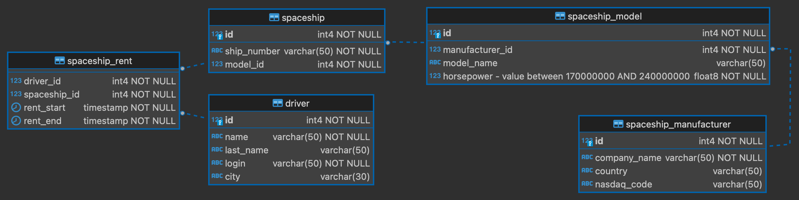

# Домашка 4. Миграции базы данных

Две тысячи n-ый год. Космический хаб сервиса Yandex.CosmoDrive для краткосрочной аренды межпланетных кораблей переходит 
на новую версию приложения космолеташеринга. 

Исходный код для формирования базы отсутствует - в вашем распоряжении имеется лишь описание стейта базы данных на каждом этапе разработки. Планируется в несколько этапов перейти к новому состоянию базы.

Вам необходимо создать миграции базы данных для того, чтобы перевести базу в указанные состояния.

## Задача
Ваша задача состоит в том, чтобы написать 3 миграции для базы данных. Миграции необходимо разместить в директории `migrations`. (В этой директории уже размещена вспомогательная миграция 0, которая удаляет одноименные таблицы, если они существовали). 

### Миграция 1
Первая миграция должна привести базу к следующей схеме:

* Допустимое значение horsepower находится между 170000000 и 240000000,
* поле `login` должно быть уникальным,
* все `id` должны автоматически увеличиваться при добавлении очередной записи в бд.

### Миграция 2
Вторая миграция должна заполнить БД данными из csv-файлов из директории `resources/init_data`

### Миграция 3
В рамках третьей миграции мы должны совершить ряд преобразований над таблицами, в которых уже присутствуют данные.

У таблицы `driver` мы должны объединить стобцы `name` и `last_name` в новый стобец `full_name` (макс. длина 255) 
(в котором укажем name и last_name через пробел). Важно, чтобы данные при переезде трансформировались правильно 
и не потерялись.

В таблице `spaceship_manufacturer` мы хотим заменить столбец `nasdaq_code` на столбец `moex_code`, перенеся в него
значения из столбца `nasdaq_code` с суффиксом `_ru` (макс. длина нового столбца 53).


## Как тестировать домашку

Запуск через Docker (рекомендуется):
```make docker-runtests```

Локальный запуск: 
```make runtests```

Для локального запуска может потребоваться:
```
  - python -m pip install --upgrade pip wheel
  - python -m pip install flake8 pytest
  - pip install -r requirements.txt
```

## Как сдать домашку
- Написать 3 sql-миграции. Положить их в директорию `migrations`.
- Запустить тесты через docker (или локально) и убедиться, что все работает.
- Запушить новую ветку в свой репозиторий. Убедиться, что тесты проходят в gitlab-е.
- Замёрджить в `master` и отправить на проверку в LMS
