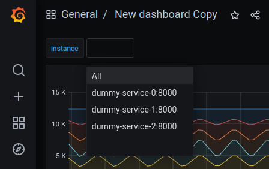
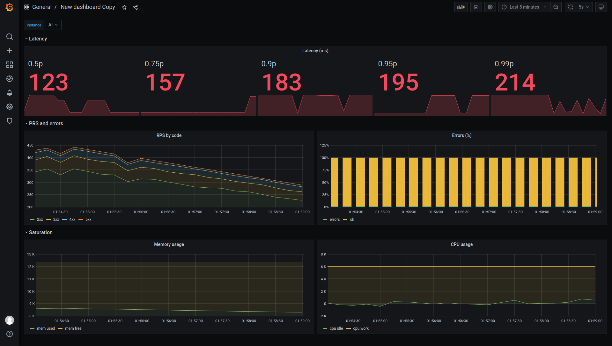

# Домашнее задание к лекции "Эксплуатация бэкенд-систем в продакшене"
В данном задании вам предлагается настроить мониторинг в Grafana для некоторого сервиса (`dummy-service`). Этот сервис активно пишет метрики, которые отгружаются в Prometheus. В Grafana, используя язык запросов, метрики можно визуализоровать.

Суть домашки - построить дашборд в Grafana, согласно подходу LTES (4 золотых сигнала мониторинга).

## Работа с приложением

### Требования
- `Docker`
- `docker-compose`

### Запуск
Перейдите в директорию со скаченным репозиотрием, и запустите:
```commandline
docker-compose build
docker-compose up --force-recreate
```
После этого будет запущенно 5 docker-контейнеров:
- три контейнера с сервисом (dummy-service);
- контейнер с `Premetheus`, у которого настроен сбор метрик с dummy-service;
- контейнер с `Grafana`, которая использует Prometheus в качестве источника данных.

Откройте Grafana UI в браузере (Яндекс браузер не рекомендуется использовать из-за того, что в нем плохо работает редактирование графиков), для этого откройте `http://localhost:3333`, введите логин `admin` и пароль `admin`.


## Задание
Создайте новый дашборд с переменной `instance`. Чтобы можно было сделать выборку по всем (значение `All`) или по конкретному инстансу приложения, меняя значение переменной:



На дашборде отобразите:
1. График задержки обработки запросов (`latency`). На графике сделайте агрегацию по персентилям. Для этого используйте метрику `request_latency_ms` типа `Summary`. При значении переменной `instance=All`, на графике должно отображаться максимальное значение. PS: Персентили уже посчитаны, и нужную персентиль можно получить по лейблу `quantile`.
2. График RPS (`traffic`). На графике, используя агрегацию, отобразите увечиление (метод increase) количества ответов по группам 2xx, 3xx, 4xx, 5xx. Для этого используйте метрику `responses` типа `Counter`. При значении переменной `instance=All`, на графике должно отображаться суммарное значение. Линии должны стакаться и идти свемху вних в порядке 2xx, 3xx, 4xx, 5xx.
3. График ошибок (`errors`). На графике отобразите две линии просуммированные 2xx, 3xx и 4xx коды ответов и 5xx коды ответов. Для этого также используйте метрику `responses`. При значении переменной `instance=All`, на графике должно отображаться суммарное значение.
4. Два графика использования CPU и памяти (`saturation`). Для этого используйте метрики `cpu_*` и `mem_*` типа `Gauge`. При значении переменной `instance=All`, на графике должно отображаться суммарное потребление CPU и памяти. Отобразите линию со значением свободной памяти над линией используемой.

Рекомендации по постраению графиков:
- Переопределяйте назвыния линий, чтобы сделать их более локаничными, используя параметр `Legend`.
- При построении графика можно менять его отображение во вкладках `Visualization` и `Display`.

Пример дашборда с графиками, который может получиться:


## Сдача домашнего задания
После создания дашборда и алертов, сделайте скриншот полученного дашборда, экспортируйте полученный дашборд в json. Для этого:
1. После создания дашборда и алертов, сделайте скриншот полученного дашборда
2. Экспортируйте полученный дашборд в json. Нажмите на кнопку `Share` > `Export`. Включите `Export for sharing externally` и нажмите `Save to file`.
3. Откройте merge-request, в который добавьте скриншот и json дошборда.
4. Ссылку на merge-request загрузите в LMS.

